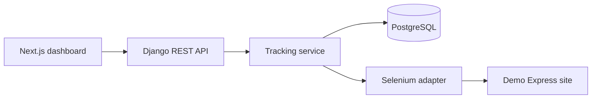

# RoutePulse — Logistics Tracking Automation Dashboard

RoutePulse is a portfolio-grade logistics application that stores shipments, launches resilient browser automation jobs, records tracking history, and presents operations data in a responsive dashboard. It demonstrates a practical separation between HTTP views, business services, Selenium adapters, and persistence.

## Business problem

Operations teams often copy tracking numbers between spreadsheets and carrier sites. That workflow is slow, difficult to audit, and easy to get wrong. RoutePulse creates one shipment register and turns a manual carrier lookup into a traceable automation job with retry history and normalized events.

## Architecture



The Django views remain thin. `TrackingService` owns retries, transactions, job state, and event creation. `CarrierTracker` defines the carrier interface; `DemoExpressTracker` is the Selenium implementation.

## Stack

- Python 3.12, Django 5, Django REST Framework
- PostgreSQL 16
- Selenium with Chromium, `WebDriverWait`, and expected conditions
- Next.js, React, TypeScript, Tailwind CSS
- Docker Compose
- pytest and Django API tests

## Quick start with Docker

```bash
cp .env.example .env
docker compose up --build
```

Open:

- Dashboard: <http://localhost:3000>
- API health: <http://localhost:8000/health/>
- Demo Express: <http://localhost:8081>

Create a shipment with `VN000001`, `VN000002`, or `VN000003`, then select **Track**.

## Local development

Backend:

```bash
cd backend
python -m venv .venv
source .venv/bin/activate  # Windows: .venv\Scripts\activate
pip install -r requirements.txt
python manage.py migrate
python manage.py runserver
```

Frontend:

```bash
cd frontend
npm install
npm run dev
```

Serve `mock-carrier/` on port 8081 (for example with Nginx or `python -m http.server 8081`). A local Chromium/Chrome installation is required for non-Docker Selenium runs.

## Environment variables

| Variable | Purpose | Default |
| --- | --- | --- |
| `DATABASE_URL` | PostgreSQL connection string | SQLite when omitted |
| `DJANGO_SECRET_KEY` | Django signing secret | development fallback |
| `DJANGO_DEBUG` | Debug mode | `true` |
| `ALLOWED_HOSTS` | Comma-separated hostnames | local hosts |
| `CORS_ALLOWED_ORIGINS` | Frontend origins | `http://localhost:3000` |
| `MOCK_CARRIER_URL` | Demo Express address used by Selenium | `http://localhost:8081` |
| `CHROME_BINARY` | Optional Chromium executable | Selenium discovery |
| `NEXT_PUBLIC_API_URL` | Browser-facing API URL | `http://localhost:8000/api` |

Never commit production secrets. `.env` is ignored; `.env.example` contains only safe placeholders.

## REST API

| Method | Endpoint | Description |
| --- | --- | --- |
| POST | `/api/shipments/` | Create a shipment |
| GET | `/api/shipments/` | List shipments |
| GET | `/api/shipments/{id}/` | Retrieve a shipment |
| POST | `/api/shipments/{id}/track/` | Run the tracking workflow |
| GET | `/api/shipments/{id}/events/` | List tracking history |
| GET | `/api/jobs/{id}/` | Retrieve an automation job |

## Selenium workflow

1. Create an `AutomationJob` and mark it `RUNNING`.
2. Open the local Demo Express site.
3. Wait for the form, submit the tracking number, and wait for a result.
4. Parse and validate the status, location, and ISO timestamp.
5. Update the shipment and insert a tracking event in one database transaction.
6. Mark the job `SUCCESS`, or retry up to three times before marking it `FAILED`.
7. Close the browser in `finally` on every path.

No real carrier website is scraped and normal page synchronization does not use `time.sleep()`.

## Tests and quality checks

```bash
cd backend && pytest
cd ../frontend && npm run lint && npm run build
```

The tests cover creation, duplicate validation, listing, retrieval, API validation, successful and failed jobs, event creation, retries, and job retrieval. Selenium is replaced with deterministic test doubles in unit tests.

## Screenshots

- Dashboard — add screenshot after running the Compose stack.
- Shipment detail timeline — add screenshot after tracking `VN000001`.
- Demo Express response — add screenshot from port 8081.

## Future improvements

- Background jobs with Celery and Redis
- Carrier-specific rate limiting and circuit breakers
- Authentication and organization workspaces
- WebSocket job progress
- Metrics, tracing, and alerting
- Additional carrier adapters behind the same interface

See [docs/architecture.md](docs/architecture.md) for design decisions and failure behavior.
