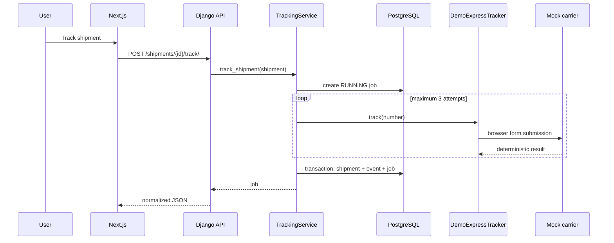

# Architecture and engineering decisions

## Boundaries

`views.py` translates HTTP to service calls. It does not know selectors, retry rules, or transaction details. `TrackingService` coordinates the workflow. `CarrierTracker` isolates carrier-specific behavior so another adapter can be added without changing the API layer.

## Consistency

Successful shipment, event, and job updates share one atomic transaction. A failed browser attempt cannot create a partial tracking event. The job records a concise attempt history for troubleshooting.

## Failure mapping

- Missing number → `TrackingNotFoundError`
- Slow page → `AutomationTimeoutError`
- Browser/network failure → `CarrierUnavailableError`
- Missing or malformed DOM data → `TrackingParsingError`
- Database exception → logged and retried, then the job is failed

Expected failures are logged as warnings; unexpected exceptions include stack traces. Browser cleanup runs in `finally`.

## Scope choices

The MVP executes a job synchronously so it runs without a queue. The `AutomationJob` contract and REST resource are ready to move behind Celery/RQ later. The mock carrier is intentionally local and deterministic; no production carrier is scraped.
